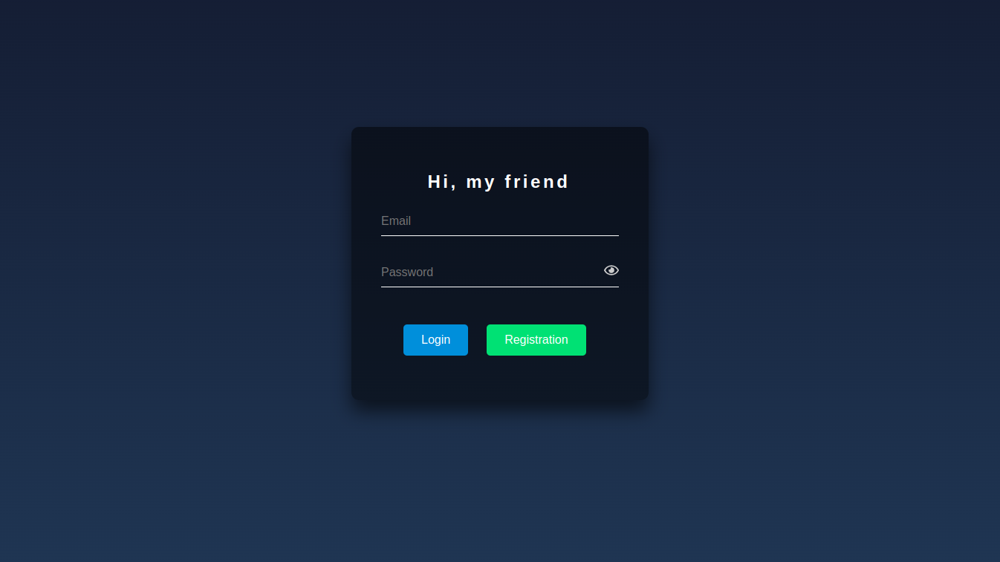

# Авторизация пользователя на React

Проект "Авторизация пользователя" разработан для обеспечения безопасного и удобного механизма аутентификации пользователей в веб-приложении.

## Технологии

Проект использует следующие технологии:

- **React**: Библиотека JavaScript для создания интерактивных пользовательских интерфейсов.
- **JWT (access, refresh)**: JSON Web Token для безопасной аутентификации пользователей и обмена данными между клиентом и сервером.
- **Express.js**: Фреймворк для создания веб-приложений на платформе Node.js.
- **TypeScript**: Язык программирования с поддержкой статической типизации, облегчающий разработку и поддержку кода.
- **MongoDB**: Гибкая документоориентированная база данных для хранения информации о пользователях и их учетных данных.
- **MobX**: Библиотека для управления состоянием приложения в React, обеспечивающая эффективное управление данными.
- **Postman**: Инструмент для тестирования API, позволяющий проверить работу аутентификации и взаимодействие с сервером.
- **Axios**: Библиотека для выполнения HTTP запросов из браузера и Node.js, используемая для взаимодействия с сервером.

## Запуск проекта

Для запуска проекта выполните следующие шаги:

### Server

1. Перейдите в директорию `server`: `cd server`
2. Установите зависимости: `npm install`
3. Запустите сервер: `npm run dev`

### Client

1. Перейдите в директорию `client`: `cd client`
2. Установите зависимости: `npm install`
3. Запустите проект: `npm start`

    После выполнения этих шагов ваше веб-приложение для авторизации пользователей будет готово к использованию.
   Откройте ваш браузер и перейдите на `http://localhost:3000`, либо проект откроется автоматически.

## Примеры использования

  
 Пример 1: Главное меню

  

   

  
 Пример 2: Ввод почты и пароля 

  

  
 Пример 3: Ошибки

  
    

   

  
 Пример 4: Просмотр пароля 

  

   

  
 Пример 5: Авторизация пользователя 

  

  
 Пример 6: В MongoDB создается user 

  

